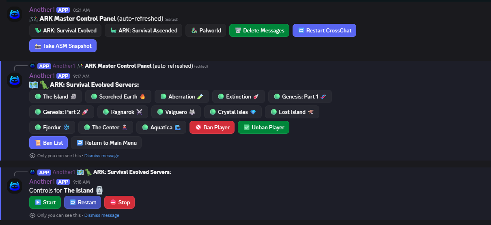

# 🎮 ARK Master Control Panel Bot



A powerful **Discord bot** designed to centrally manage **ARK: Survival Evolved**, **ARK: Survival Ascended**, and **Palworld** servers from a single Discord control panel.  
Built with `discord.py`, RCON, webhooks, and Windows server integrations, this bot provides a full-featured admin UI with buttons, modals, confirmations, logging, and automation.

---

## ✨ Features

### 🦖 Server Management
- Start, stop, and restart servers via:
  - **ARK Server Manager (ASM)**
  - **WindowsGSM**
  - **Palworld (WindowsGSM)**
- Supports **multiple clustered servers**
- Real-time server status checks (🟢 Online / 🔴 Offline)
- Displays **ARK ASA version** directly from server logs

---

### 🎛️ Discord Control Panel
- Interactive **button-based UI**
- Category-based navigation:
  - 🦖 ARK: Survival Evolved
  - 🦕 ARK: Survival Ascended
  - 🐉 Palworld
- Confirmation dialogs for all destructive actions
- Auto-refreshing & auto-restoring control panel

---

### 🚫 Player Moderation
- Cluster-wide **Ban / Unban** via RCON
- Steam API integration:
  - Resolves Steam names
  - Clickable profile links
- Reads `BanList.txt` and displays current bans
- Moderation actions are fully logged

---

### 📸 Admin Utilities
- Capture **ARK Server Manager window screenshot** (even minimized)
- Restart **CrossChat Evolved Bot**
- Bulk message deletion with confirmation
- Automatic cleanup of command spam

---

### 🧾 Logging & Automation
- Logs all admin actions to a dedicated Discord channel
- Auto-cleans bot messages after actions
- Auto-refreshes control panel every 5 minutes
- Auto-restores panel if deleted

---

## 🛠️ Tech Stack

- **Python 3.10+**
- **discord.py (app_commands & UI Views)**
- `aiohttp`
- `psutil`
- `pyautogui`
- `pygetwindow`
- `rcon`
- `Pillow (PIL)`

---

## 📂 Server Support

### ARK: Survival Evolved (ASM)
- Multi-map cluster support
- RCON-based moderation
- Webhook-controlled start/stop/restart

### ARK: Survival Ascended (WindowsGSM)
- Start / Stop / Restart / Update
- Version parsing from logs

### Palworld
- WindowsGSM integration
- Online status detection via process scan
- Full lifecycle control (Start / Stop / Restart / Update)

---

## ⚙️ Configuration

### Required Variables

Edit these at the top of the script:

```python
TOKEN = "YOUR_DISCORD_BOT_TOKEN"
CONTROL_CHANNEL_ID = 000000000000000000
LOG_CHANNEL_ID = 000000000000000000
STEAM_API_KEY = "YOUR_STEAM_API_KEY"
ALLOWED_ROLES = ["Admin", "Moderator", "Server Manager"]

